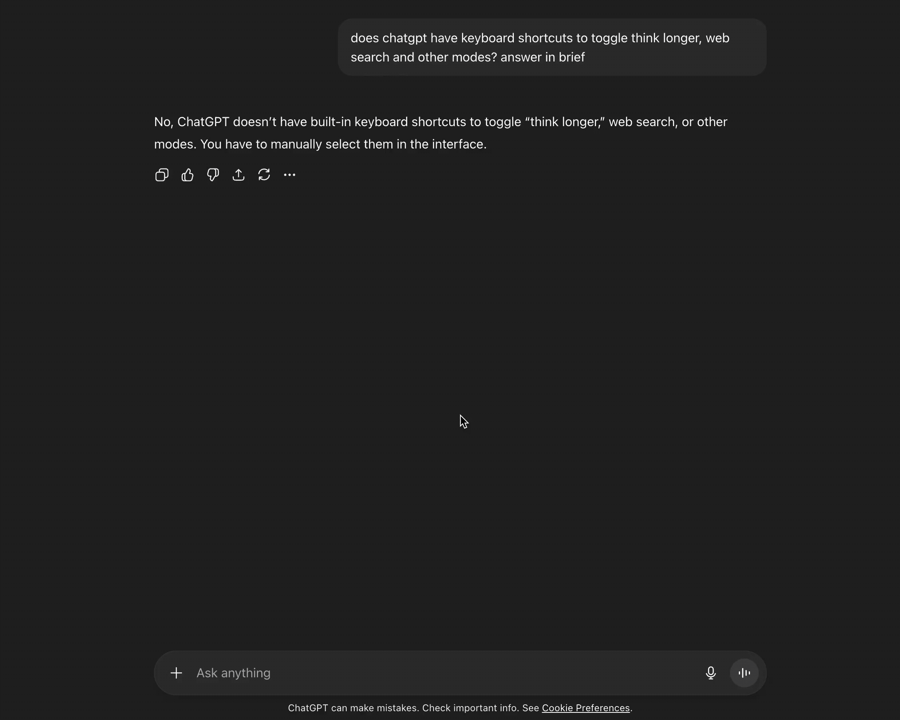

# Togglr

a tiny chrome extension that lets you toggle modes like think longer, web search, deep research, and create image with keyboard shortcuts.

<div align="center">
    
</div>

### usage

right now shortcuts are fixed. i might add the ability to edit them in the future.

- **mac**:
  - think longer: `ctrl + shift + t`
  - web search: `ctrl + shift + w`
  - create image: `ctrl + shift + i`
  - deep research: `ctrl + shift + r`
- **windows/linux**:
  - think longer: `alt + shift + t`
  - web search: `alt + shift + w`
  - create image: `alt + shift + i`
  - deep research: `alt + shift + r`

### install (dev / local)

1. clone this repo:

   ```
   git clone https://github.com/rittikbasu/togglr.git
   ```

2. go to chrome://extensions/

3. toggle "developer mode"

4. click "load unpacked" and pick this folder

5. open chatgpt and press the shortcuts

### how it works

- if a mode is already selected, we click it to remove (toggle off)
- otherwise we open the `+` menu, find the item and select it

### known quirks

- if openai renames menu items (e.g. "more" or "web search"), the finder may need a small update
- super slow uis might need an extra beat, i already debounce + poll sensibly
- if you use vimium/karabiner/etc. make sure the combos don't collide
